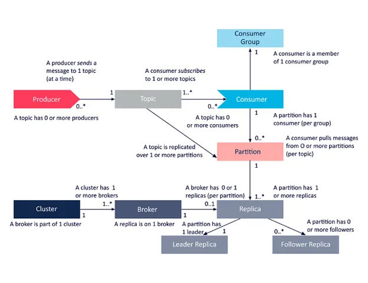

# Kafka에서 메세지 순서를 보장하는 방법



Kafka의 구성요소는 다음과 같은 관계를 지니고 있다. 실제로 메세지가 교환되는 채널의 단위인 topic은 여러개의 partition으로 분리가 가능하기 때문에, 병렬 처리와 로드 밸런싱이 가능한 구조이다.  
그래서 단일 partition을 사용할 때에는 기본적으로 전송되는 메세지의 순서 보장이 가능하지만, partition이 둘 이상이 되어 서로 다른 broker에 위치하게 되면 개별 partition 내에서만 순서 보장이 가능하다.  
하지만 때로는 채널(topic)로 전송되는 메세지의 순서를 보장해야 될 때가 있다. 예를 들면 쇼핑몰에서 주문/결제/교환/반품 기록을 전송하거나, 계좌의 입출금 기록, 다중 사용자 환경에서의 데이터 변경 등이 있을 수 있다.  
Kafka에서는 다중 broker/다중 partition 상황에서도 전송되는 메세지 간의 순서를 보장할 수 있는 2가지 방법을 제공한다.

## Hashing Key Partition
전송되는 메세지에 Key를 지정하고, Key 값의 해시값을 구해서 해시값을 모듈로 연산한 값으로 메세지가 저장되는 partition을 지정하는 방법이다.  
Key는 다음과 같이 지정이 가능하다.
```bash
broker-list localhost:9092 \
topic my-topic \
property "parse.key=true" \
property "key.separator=:" \
```
Hashing Key Partition을 사용하면 메시지 특성에 맞게 순서 보장이 필요한 단위를 기준으로 Key를 지정해 순서를 보장할 수 있지만, Key 값의 분포에 따라 특정 partition에 메세지가 몰리는 등 로드 밸런싱이 원활하게 이루어지지 않을 가능성이 있습니다.

## Custom Partitioner
Hashing Key로 시스템 요구사항을 만족하기 어렵다면, Partitioner를 프로그래밍 언어로 커스터마이징할 수 있습니다. Custom Partitioner를 통해 메세지가 전송될 Partition을 결정하는 데에 더욱 구체적이고 정교하게 비즈니스 로직을 적용할 수 있습니다.

## Reference
- [How to use Apache Kafka to guarantee message ordering?](https://medium.com/latentview-data-services/how-to-use-apache-kafka-to-guarantee-message-ordering-ac2d00da6c22)