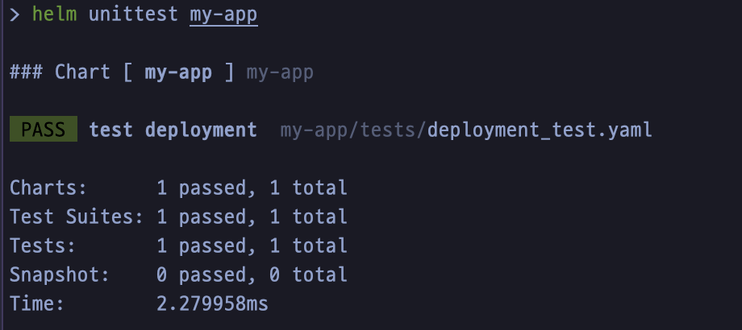

# Helm Unit Test

- helm 차트를 작성하고 고도화하다 보면 중첩된 템플릿들로 인해 전체 차트의 복잡성이 높아짐
- 따라서 한 부분의 수정이 미치는 영향 범위를 제대로 파악하기 어렵고, 이는 휴먼 에러에 취약한 구조
- helm-unittest는 이러한 운영상의 문제를 개발 영역의 단위 테스트와 같이 해결할 수 있게 해줌
  - 실제 쿠버네티스 리소스를 생성하지 않으면서, 개별 템플릿에 대해 테스트 케이스를 작성할 수 있음

## Installation

```shell
$ helm plugin install https://github.com/helm-unittest/helm-unittest.git
```

## Getting Started

- 기본적인 helm 차트를 하나 생성한다.
```shell
$ helm create my-app
```
- 차트 디렉토리의 루트 경로에 `tests` 디렉토리를 생성한다.
- `tests` 하위에 단위 테스트 매니페스트를 생성한다.
  - 일반적으로는 테스트하려는 템플릿 이름에 `_test`를 붙여 생성한다.
    - ex) `deployment_test.yaml`
- 테스트 매니페스트에 수행하려는 단위 테스트를 기술한다. 작성할 수 있는 주요 키워드는 다음과 같다.
  - suite: 테스트 스위트 이름
  - values: 테스트를 위해 템플릿을 생성할 때 사용할 values 파일
  - set: 테스트 스위트에서 values를 직접 지정할 때 사용
  - tests: 실제 수행되어야 하는 테스트 목록을 기술
    - it: 개별 테스트의 이름
    - asserts: 테스트의 성공/실패 여부를 확인하는 조건을 기술
- 테스트 매니페스트 작성이 완료되었다면 CLI로 단위 테스트를 수행한다.
```shell
$ helm unittest my-app
```


## Reference
- [helm-unittest](https://github.com/helm-unittest/helm-unittest)
  - [Testing Document](https://github.com/helm-unittest/helm-unittest/blob/main/DOCUMENT.md)
- [Builtin Quality for Helm Charts: unit testing to the rescue!](https://medium.com/@gcavalcante8808/builtin-quality-for-helm-charts-unit-testing-to-the-rescue-2cb9d5c1ddc8)